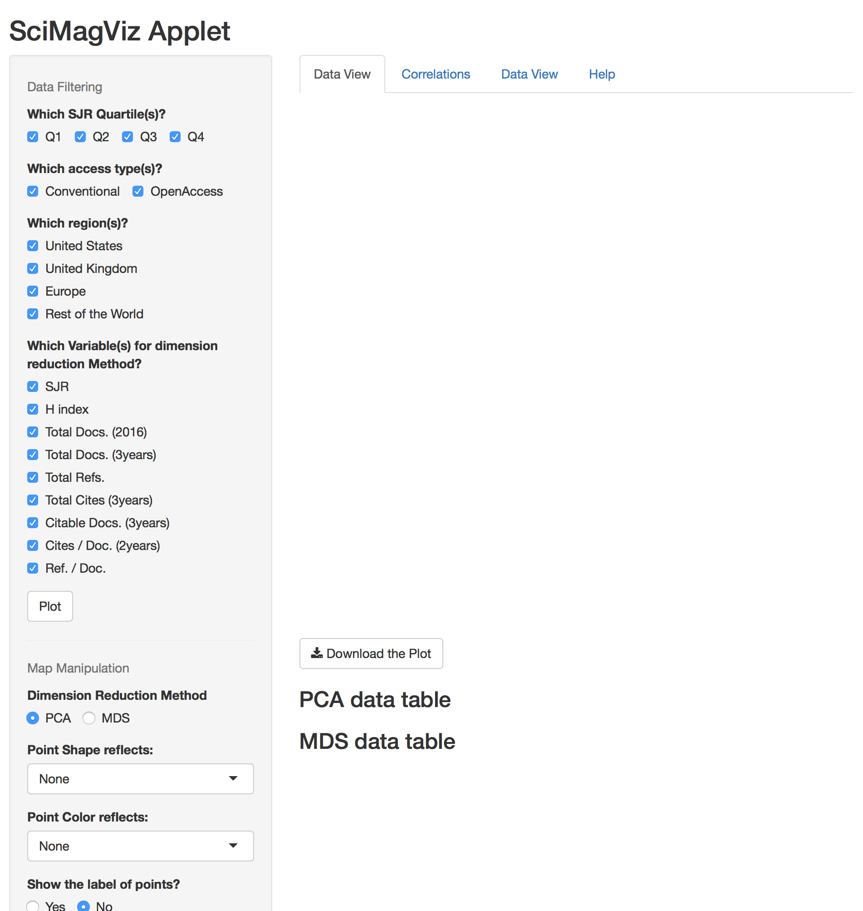
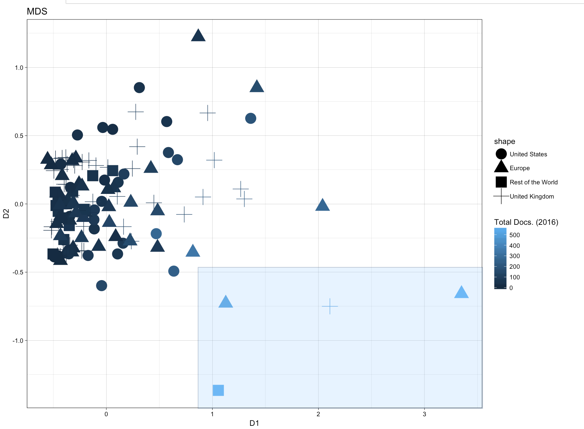
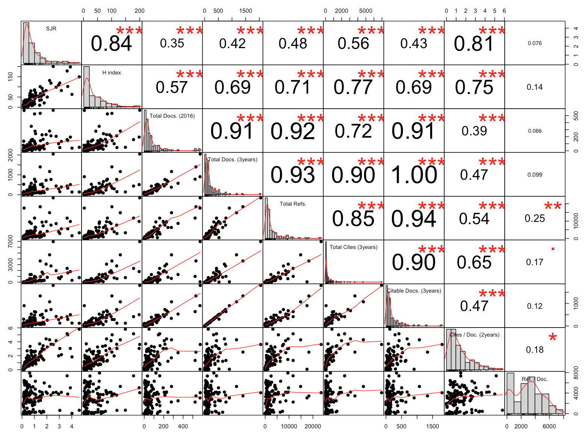

# 1.What is SciMagViz Applet? 

It is a graphical user interface(GUI) added to a R code, which runs on a R server! 

Firstly, Instead of changing parameters by typing, one can change the parameters using widgets. However, there are more important features in this applet. 
The applet is mainly an *interactive visualization* tool. So not only easily and efficiently it is possible to filter the dataset, and confine it to what matters to the user, but also the plot can be *explored* excitingly using brushing and zooming. It is an *interactive exploratory data visualiztion* tool to get insight into the dataset. Purpose of exploration? Can be an open-end scenario, rambling around in order to discover some interesting things! Is exploration anything else? 
The value of the findings is assessed by the beholder! So I may search for the relation of open access journals with top rank journals, and you may seek for non-European, non-North American journals to know how well they do comparing to western journals. 

# 2.About the data 

The data is derived from [Scimago and Journal Country Rank website](http://www.scimagojr.com/). It is the data of 130 operations research(OR) and management science(MS) journals. I chose this field because this field had chosen me years ago! I am an OR graduate indeed. Furthermore, I was trying to know how meritorious one specific journal was when I encountered this amazing website. 
The website has its own visualization tools, so don't miss checking them! 

# 3.Applet Sections

The applet is nothing really complicated. It is simple, and indeed a personal tool that I though would be handy for someone, well, maybe! Nevertheles, the correct way is introduction of it, whether simple or complicated. 

Let's start with the entry scene. 

On the left side, there are all widgets and tools to manipulate the data and the plots. The plots are going to be shown on the right side of the screen, that white vast empty space in figure1! 

On the top of that currently empty canvas, there are four tabs, that you definitely know, otherwise you could not read this manual! The first tab is for showing the plot, the second is for showing a very nice correlation matrix, an augmented one, an enriched one, from `PerformanceAnalytics` package. The third tab includes searchable, sortable dataset. The forth is the help. 

Filtering the dataset can be done in the section shown in figure2. At least partially it can be done there. What a user can do is filtering the values of some categircal variables, and choosing which quantitative variables should be included in the dataset. The plot is going to be visualized based on dimension-reduction of these selected quantitative variables. A description of the variables is presented in the next section. 

At the buttom of the tall gray vertical ribbon, there are tools for manipulation of plots, in order to get what is more acceptable by the user. Probably the most important option is choosing *the dimension-reduction method* between principal component analysis(PCA), and Multidimensional Scaling(MDS). What is the difference? well, there is a lot to say in reply to this question, but very shortly it should be said that PCA has linearity assumption, and MDS is a non-linear mapping which tries to preserve the intra-object distances. Generally, if two objects are similar, they would reside close to each other - ideally!-, and if they are dissimilar, they would locate far from each other. PCA method here is indeed a *biplot* , so variables are super-imposed on the plot as vectors. In the direction of the vectors, the value of variables increase, ideally! 

Another important widgets are the *Point Shape reflects:* and *Point Color reflects:* tools. Using them, one can map selected variables on the shape and color of objects of a plot. 

For instance figure4 is a bi-plot produced by the applet. The color of the objects reflects their h-index values, and the shape reflects the region that the journal belongs to. We can see that far-from-crowd journals with very high h-index are triangles, i.e. from Europe! And all are western journals except one guy at the buttom, a rectangle! What is the difference between this dark rectangle and those light blue triangles for instance? here the vectors help. The dark ractangle is on the direction of `Total Docs. (2016)`, while it is no good at for example `SJR`. Further information and details can be gained by brushing. 

Figure5 is the MDS output of the dataset. Here, as I was exploring and found the non-western guy interesting, I mapped `Total Docs. (2016)` as the color and we can see that how much this journal is high on this variable! A really prolific journal I guess! How to know more about it, and about its neighbours? Keeping the left-click of the mouse and covering all interesting objects. Below the plot, a detailed table of these covered objects would be shown. 

Also by double clicking on the brushed area, we would zoom-in into the map. By double clicking on the zoomed-in map, we would come back to the tele lense! 

Figure6 is another example. I wanted to explore the relation between the journal region and its SJR Quartile. It is difficult to see due to overlapping, which can be alleviated by zooming-in, but still it can be seen that Q1 level are western. Not surprising unfortunately. Another thing is, most of the far-from-crowd journals, journals with unique features, are European and not from United States. 

# 4.Meta Data

Meta data should be introduced earlier, but I though a probable user of the applet already knows about h-index and citation per document. Anyway, from the [website](http://www.scimagojr.com/help.php#rank_journals), I copied the below description:

-SJR (SCImago Journal Rank) indicator: It expresses the average number of weighted citations received in the selected year by the documents published in the selected journal in the three previous years, --i.e. weighted citations received in year X to documents published in the journal in years X-1, X-2 and X-3. See detailed description of SJR (PDF).

-H Index: The h index expresses the journal's number of articles (h) that have received at least h citations. It quantifies both journal scientific productivity and scientific impact and it is also applicable to scientists, countries, etc. (see H-index wikipedia definition)

-Total Documents (3years):Published documents in the three previous years (selected year documents are excluded), i.e.when the year X is selected, then X-1, X-2 and X-3 published documents are retrieved. All types of documents are considered, including citable and non citable documents.

-Citable Documents (3 years): Number of citable documents published by a journal in the three previous years (selected year documents are excluded). Exclusively articles, reviews and conference papers are considered.

-Total Cites (3years):Number of citations received in the seleted year by a journal to the documents published in the three previous years, --i.e. citations received in year X to documents published in years X-1, X-2 and X-3. All types of documents are considered.

-Cites per Document (2 years):Average citations per document in a 2 year period. It is computed considering the number of citations received by a journal in the current year to the documents published in the two previous years, --i.e. citations received in year X to documents published in years X-1 and X-2.

-Cited Documents:Number of documents cited at least once in the three previous years, --i.e. years X-1, X-2 and X-3

-Total References:It includes all the bibliographical references in a journal in the selected period.
-References per Document:Average number of references per document in the selected year.

# 5.Correlation

Shouldn't be forgotten! It is very important and very beautiful. As I said, it is from `PerformanceAnalytics` package. Figure7 shows the correlations, the distributions, scatterplots of pair variables, and statistical significace of the coefficients. 

I hope you find the applet interesting :) 

# 6.Conclusion 

This applet is just an example to see what interactive visualization can do, and how I can make them. Well, this is not the first of mine, but anyway I fould this dataset interesting. 

More features can be added to this applet. The relations between categorical variables,and the clustering features are two of the missing parts in the current version. Please contribute to the project if you have found it interesting, since the code is publically available on [my github repo](https://github.com/Pomelo64/scimag).

Shahin Ashkiani
Contact@Shahin-Ashkiani.com

5 Oct 2017
